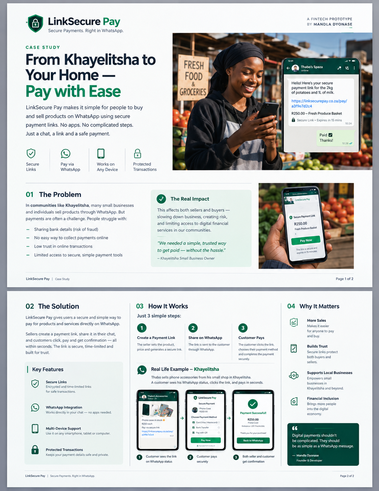

# LinkSecure Pay

> Secure payment links for buying and selling through WhatsApp.

**Built by Mandla Dyonase**

---
**Frontend:**  
https://plug-play-checkout-payment-link.vercel.app/

**API:**  
https://linksecure-pay-api.onrender.com
must log in on the render infrustructure

**API Documentation:**  
https://linksecure-pay-api.onrender.com/docs

## Case Study

LinkSecure Pay is a fintech prototype designed to make it easier for
small businesses and individuals to accept payments through WhatsApp.

The concept focuses on a simple flow:

**Create a secure payment link → Share it on WhatsApp → Customer pays**

### The Problem

In communities such as Khayelitsha, many small businesses already use
WhatsApp to communicate with customers and sell products.

However, collecting payments can introduce friction:

- Sharing bank details manually
- Increased risk of exposing sensitive payment information
- No simple payment flow inside the sales conversation
- Limited access to convenient digital payment tools
- Difficulty providing customers with a clear payment confirmation

### The Solution

LinkSecure Pay introduces a secure, unique payment link that can be
shared directly through WhatsApp.

Instead of sending banking information through a chat, the seller sends
the customer a dedicated payment link containing the payment request.

The customer opens the link, completes the payment, and receives
confirmation.

---

## How It Works

### 1. Create a Payment Link

The seller creates a payment request containing the product and amount.

### 2. Share Through WhatsApp

The generated payment link is sent to the customer through WhatsApp.

### 3. Customer Pays

The customer opens the link and completes the payment through the
secure payment flow.

### 4. Confirmation

The transaction result is returned to the customer and seller.

---

## Real-World Scenario

Imagine a small phone-accessories business in Khayelitsha.

A customer asks about a phone case through WhatsApp.

Instead of sending bank details manually, the seller sends a LinkSecure
Pay payment link.

The customer:

1. Opens the link from WhatsApp
2. Reviews the product and amount
3. Completes the payment
4. Receives confirmation

This keeps the entire sales journey simple and familiar.

---

## Prototype Case Study

---

## Key Objectives

- Enable simple payment collection through WhatsApp
- Reduce the need to share banking details manually
- Provide time-limited payment links
- Create a familiar customer payment experience
- Support small businesses with accessible digital payment tooling
- Build a foundation for a scalable payment-link platform

---

## Project Status

**Prototype / Development**

This project is being developed as a payment-link platform prototype,
with security, API design, transaction handling and deployment
considerations forming part of the engineering roadmap.

---

## 🛠️ Tech Stack

### Backend

### Frontend

### API & Documentation

### Infrastructure & Development

---

## 📖 API Documentation

LinkSecure Pay exposes an interactive **Swagger UI** powered by OpenAPI.

### Local Swagger UI

When the backend is running:

**http://127.0.0.1:8000/docs**

Swagger provides an interactive interface for:

* Exploring API endpoints
* Viewing request/response schemas
* Testing endpoints
* Testing payment-link creation
* Testing checkout requests
* Inspecting API responses

### OpenAPI Specification

The raw OpenAPI specification is available at:

**http://127.0.0.1:8000/openapi.json**

---
## Author

**Mandla Dyonase**  
Software Developer  
Cape Town, South Africa
